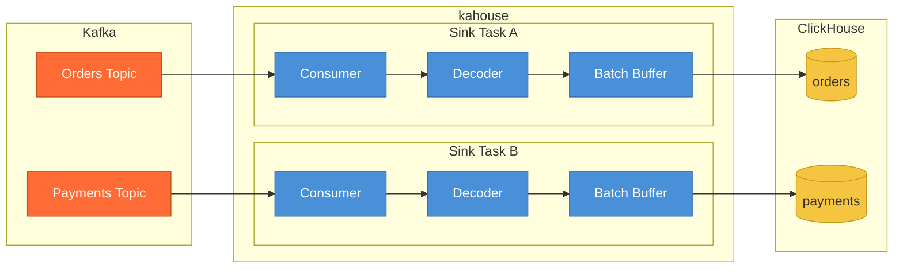

# kahouse

A lightweight Go service that sinks Kafka topics into ClickHouse tables.



Each topic gets its own sink task with an independent consumer, decoder, and batch buffer. A sink task runs a single loop: read a message, decode it, buffer it, and flush to ClickHouse when a size or time threshold is reached. A failure in one topic stops only that task -- the others keep running. Stopped topics can be restarted via the [admin API](#admin-api) without redeploying.

Delivery is **at-least-once**. Offsets are committed only after a batch is successfully written to ClickHouse. On restart, some records may be re-delivered. Deduplication is your responsibility (e.g. `ReplacingMergeTree` with an application-level key).

## Quick start

```bash
go build -o kahouse ./cmd/kahouse
./kahouse -config kahouse.yaml
```

Or with Docker:

```bash
docker build -t kahouse .
docker run -v $(pwd)/kahouse.yaml:/kahouse.yaml kahouse
```

## Configuration

Create a YAML config file and pass it with `-config <path>` or the `KAHOUSE_CONFIG` environment variable. Defaults to `kahouse.yaml` in the working directory.

```yaml
kafka_brokers: "localhost:9092"
schema_registry: "http://localhost:8081"
clickhouse_dsn: "tcp://localhost:9000"
group_id: "kahouse"
input_format: "avro"              # avro | json | string
dlq_topic_suffix: ".dlq"

batch_size: 10000                 # max records per batch
batch_delay_ms: 200               # max ms to wait before flushing
max_retries: 5
retry_backoff_ms: 100

topic_tables:
  - topic: "orders"
    table: "default.orders"
    format: "json"                # override global format
  - topic: "payments"
    table: "default.payments"
    format: "string"
    string_value_column: "raw"
    max_retries: 0                # fail fast, stop on first write error
```

See `config.yaml.example` for a full annotated example.

### Input formats

| Format | Description | Schema Registry required |
|--------|-------------|--------------------------|
| `avro` | Confluent wire-format Avro. Schemas are fetched and cached from Schema Registry. | Yes |
| `json` | Single JSON object per message. Integers decode as `Int64`, decimals as `Float64`. | No |
| `string` | Raw message value stored in a single column (configured via `string_value_column`). | No |

### Per-topic overrides

Each topic can override `format`, `string_value_column`, `batch_size`, `batch_delay_ms`, `max_retries`, and `retry_backoff_ms`. Omit a field to inherit the global default. Setting a field to `0` is valid and takes effect (it is not treated as "not set").

### Kafka authentication

SASL and TLS are supported. All auth fields are optional -- omit them for unauthenticated clusters.

```yaml
kafka_security_protocol: "SASL_SSL"
kafka_sasl_mechanism: "PLAIN"
kafka_sasl_username: "your-api-key"
kafka_sasl_password: "your-api-secret"
kafka_ssl_ca_location: "/path/to/ca.crt"     # only for custom CAs
```

Schema Registry authentication:

```yaml
schema_registry_username: "your-sr-api-key"
schema_registry_password: "your-sr-api-secret"
```

Each topic gets its own consumer group in the format `kahouse-<group_id>-<topic>`, ensuring full offset isolation between topics.

## ClickHouse

Table columns must match the fields in the decoded messages. kahouse does not inject any metadata columns -- your table schema is entirely up to you.

```sql
CREATE TABLE default.orders (
    id        Int64,
    name      String,
    price     Float64
) ENGINE = MergeTree()
ORDER BY id
```

For `Nullable` Avro fields, use `Nullable(T)` column types. For sparse JSON (where records may have different keys), all columns that might be absent should be `Nullable`.

Async inserts are enabled by default (`async_insert=1, wait_for_async_insert=1`).

## Error handling

Write failures are retried with exponential backoff. If all retries are exhausted, the task stops. Since Kafka retains messages, restarting the task replays from the last committed offset.

Decode errors (bad JSON, schema mismatch, corrupted payload) also **stop the task** by default. This is intentional -- bad data in a data warehouse should be investigated, not silently discarded. When the cause is known and you need to unblock consumption, use repair mode.

### Repair mode

Enable repair mode per topic via the [admin API](#admin-api):

| Mode | Behavior |
|------|----------|
| `dlq` | Send bad messages to the DLQ, continue consuming good ones |
| `skip` | Discard bad messages, continue consuming |

Repair mode resets to off when a topic is restarted, preventing forgotten repair modes from hiding future bad data.

### Dead letter queue

When repair mode is set to `dlq`, bad messages are forwarded to `<topic><dlq_topic_suffix>` (default: `<topic>.dlq`). Write failures never go to the DLQ -- they always stop the task.

Each DLQ record is a JSON object:

```json
{
  "original_topic": "orders",
  "error": "failed to decode message: ...",
  "timestamp": 1712345678000,
  "key": "...",
  "value": "...raw message..."
}
```

## Observability

Default port is `9090` (configurable via `metrics_port`).

### Health endpoints

| Endpoint | Description |
|----------|-------------|
| `GET /livez` | Returns 200 if at least one task is running, 503 if all stopped |
| `GET /readyz` | Returns 200 if ClickHouse is reachable and all consumers have partition assignments |
| `GET /metrics` | Prometheus metrics |

### Admin API

Operational endpoints for managing individual topics at runtime.

| Endpoint | Description |
|----------|-------------|
| `GET /api/topics` | List all topics with status and repair mode |
| `POST /api/topics/{topic}/stop` | Stop a single topic |
| `POST /api/topics/{topic}/start` | Start a stopped topic (409 if already running) |
| `POST /api/topics/{topic}/restart` | Stop and start a topic |
| `POST /api/topics/{topic}/repair` | Enable repair mode: `{"mode":"dlq"}` or `{"mode":"skip"}` |
| `DELETE /api/topics/{topic}/repair` | Disable repair mode |

```bash
# Check which topics are running
curl http://localhost:9090/api/topics

# Start a stopped topic
curl -X POST http://localhost:9090/api/topics/orders/start

# Enable DLQ repair mode
curl -X POST http://localhost:9090/api/topics/orders/repair -d '{"mode":"dlq"}'

# Disable repair mode
curl -X DELETE http://localhost:9090/api/topics/orders/repair
```

### Prometheus metrics

All metrics are labeled by `topic`.

| Metric | Type | Description |
|--------|------|-------------|
| `kahouse_msg_consumed_total` | Counter | Messages read from Kafka |
| `kahouse_msg_produced_total` | Counter | Messages written to ClickHouse |
| `kahouse_msg_failed_total` | Counter | Deserialization errors + write failures |
| `kahouse_msg_dlq_total` | Counter | Messages forwarded to DLQ |
| `kahouse_task_stopped` | Gauge | 1 = stopped, 0 = running |
| `kahouse_task_restarts_total` | Counter | Admin API restarts |
| `kahouse_batch_size` | Histogram | Records per flushed batch |
| `kahouse_batch_delay_seconds` | Histogram | Age of oldest record in batch at flush time |
| `kahouse_process_latency_seconds` | Histogram | ClickHouse write duration (includes retries) |
| `kahouse_write_retry_count` | Histogram | Retry attempts per batch write |

## Testing

```bash
# Unit tests
go test ./...

# Integration tests (starts all deps via Docker Compose)
./scripts/test-integration.sh
```

## License

[MIT](LICENSE)
