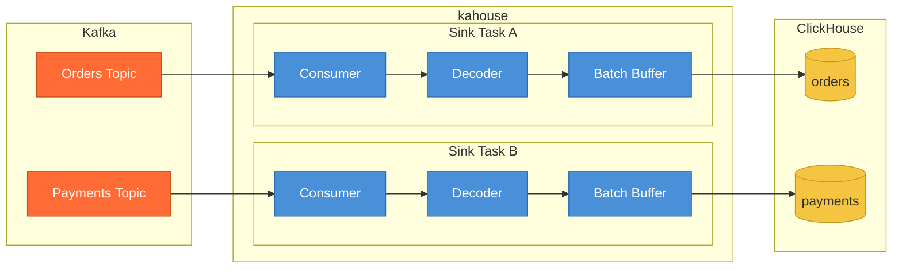

# kahouse

A lightweight Go service that sinks Kafka topics into ClickHouse tables. Each topic gets its own consumer and independent batch pipeline.



Each sink task runs two goroutines: a **consumer loop** that reads and decodes messages, and a **batch processor** that accumulates records and flushes them to ClickHouse when a size or time threshold is reached. Write failures are retried with exponential backoff; if all retries are exhausted the task stops. Decode errors (bad data, schema mismatch) also **stop the task** by default -- use [repair mode](#repair-mode) to route them to the DLQ instead.

**Topic isolation**: each topic runs independently with its own consumer, decoder, and batch buffer. A failure in one topic (bad data, schema change, ClickHouse error) stops only that task -- the others keep running. Stopped topics can be restarted via the admin API without redeploying.

### Delivery semantics

kahouse provides **at-least-once** delivery. Offsets are committed only after a batch is successfully written to ClickHouse. On restart, some records may be re-delivered.

To handle duplicates, kahouse injects three metadata columns into every record:

| Column | Type | Description |
|--------|------|-------------|
| `kafka_topic` | `String` | Source topic |
| `kafka_partition` | `Int32` | Source partition |
| `kafka_offset` | `Int64` | Source offset |

Using `ReplacingMergeTree` with `ORDER BY (kafka_topic, kafka_partition, kafka_offset)` gives practical deduplication -- ClickHouse merges away duplicates in the background. Use `FINAL` in queries when exact results are needed before a merge has run.

## Quick start

```bash
# Build
go build -o kahouse ./cmd/kahouse

# Run (with config file or env vars)
./kahouse
```

Or with Docker:

```bash
docker build -t kahouse .
docker run -e KAHOUSE_KAFKA_BROKERS=kafka:9092 \
           -e KAHOUSE_CLICKHOUSE_DSN=tcp://clickhouse:9000 \
           -e KAHOUSE_TOPIC_TABLES='[{"topic":"orders","table":"default.orders"}]' \
           kahouse
```

## Configuration

Copy `config.yaml.example` to `kahouse.yaml` and edit. Environment variables with the `KAHOUSE_` prefix override file values (e.g. `KAHOUSE_KAFKA_BROKERS`).

```yaml
kafka_brokers: "localhost:9092"
schema_registry: "http://localhost:8081"
clickhouse_dsn: "tcp://localhost:9000"
group_id: "kahouse"
input_format: "avro"              # avro | json | string
dlq_topic_suffix: ".dlq"

batch_size: 10000                 # max records per batch
batch_delay_ms: 200               # max ms to wait before flushing
max_retries: 5
retry_backoff_ms: 100

topic_tables:
  - topic: "orders"
    table: "default.orders"
    format: "json"                # override global format
  - topic: "payments"
    table: "default.payments"
    format: "string"
    string_value_column: "raw"
    max_retries: 0                # fail fast, stop on first write error
```

### Per-topic overrides

Each topic can override `format`, `string_value_column`, `batch_size`, `batch_delay_ms`, `max_retries`, and `retry_backoff_ms`. Omit a field to inherit the global default. Setting a field to `0` is valid and takes effect (it is not treated as "not set").

### Input formats

| Format | Description | Schema Registry required |
|--------|-------------|--------------------------|
| `avro` | Confluent wire-format Avro. Schemas are fetched and cached from Schema Registry. | Yes |
| `json` | Single JSON object per message. Integers decode as `Int64`, decimals as `Float64`. | No |
| `string` | Raw message value stored in a single column (configured via `string_value_column`). | No |

### Config file search order

1. `./kahouse.yaml`
2. `./config.yaml`
3. `$HOME/kahouse.yaml`
4. `$HOME/config.yaml`
5. `/etc/kahouse/kahouse.yaml`
6. `/etc/kahouse/config.yaml`

### `KAHOUSE_TOPIC_TABLES` environment variable

Topic mappings can be provided as a JSON array via environment variable, useful for container deployments:

```bash
export KAHOUSE_TOPIC_TABLES='[{"topic":"orders","table":"default.orders","format":"json"}]'
```

## ClickHouse table requirements

Tables must include the three metadata columns for offset tracking and deduplication. Use `ReplacingMergeTree` ordered by these columns:

```sql
CREATE TABLE default.orders (
    -- your data columns
    id        Int64,
    name      String,
    price     Float64,

    -- required metadata columns
    kafka_topic     String,
    kafka_partition Int32,
    kafka_offset    Int64
) ENGINE = ReplacingMergeTree()
ORDER BY (kafka_topic, kafka_partition, kafka_offset)
```

For `Nullable` Avro fields, use `Nullable(T)` column types. For sparse JSON (where records may have different keys), all columns that might be absent should be `Nullable`.

Async inserts are enabled by default (`async_insert=1, wait_for_async_insert=1`).

## Kafka authentication

kahouse supports SASL and TLS authentication. All auth fields are optional -- omit them for unauthenticated clusters.

```yaml
kafka_security_protocol: "SASL_SSL"
kafka_sasl_mechanism: "PLAIN"
kafka_sasl_username: "your-api-key"
kafka_sasl_password: "your-api-secret"
kafka_ssl_ca_location: "/path/to/ca.crt"     # only for custom CAs
```

Schema Registry authentication is also supported:

```yaml
schema_registry_username: "your-sr-api-key"
schema_registry_password: "your-sr-api-secret"
```

### Consumer group ID

Each topic gets its own consumer group in the format `kahouse-<group_id>-<topic>`. This ensures full offset isolation between topics.

## Health and metrics

Default port is `9090` (configurable via `metrics_port`).

| Endpoint | Description |
|----------|-------------|
| `GET /livez` | Liveness -- returns 200 if at least one task is running, 503 if all stopped |
| `GET /readyz` | Readiness -- returns 200 if ClickHouse is reachable and all consumers have partition assignments |
| `GET /metrics` | Prometheus metrics |

### Admin API

Operational endpoints for managing individual topics at runtime. No deploy or pod restart needed.

| Endpoint | Description |
|----------|-------------|
| `GET /api/topics` | List all topics with status (`running`/`stopped`) and repair mode |
| `POST /api/topics/{topic}/stop` | Stop a single topic |
| `POST /api/topics/{topic}/start` | Start a stopped topic (returns 409 if already running) |
| `POST /api/topics/{topic}/restart` | Stop (if running) and start a topic |
| `POST /api/topics/{topic}/repair` | Enable repair mode: `{"mode":"dlq"}` or `{"mode":"skip"}` |
| `DELETE /api/topics/{topic}/repair` | Disable repair mode (back to fail-on-error) |

Examples:

```bash
# Check which topics are running
curl http://localhost:9090/api/topics

# Restart a failed topic after fixing the root cause
curl -X POST http://localhost:9090/api/topics/orders/start

# Force-restart a running topic (stop + start)
curl -X POST http://localhost:9090/api/topics/orders/restart

# Enable DLQ repair mode to drain bad messages
curl -X POST http://localhost:9090/api/topics/orders/repair \
  -d '{"mode":"dlq"}'

# Disable repair mode when done
curl -X DELETE http://localhost:9090/api/topics/orders/repair
```

### Repair mode

By default, a message that fails decoding (bad JSON, schema mismatch, corrupted payload) **stops the topic task**. This is intentional -- bad data in a data warehouse should be investigated, not silently discarded.

When the cause is known and you need to unblock consumption, enable repair mode per topic:

| Mode | Behavior |
|------|----------|
| `dlq` | Send bad messages to the DLQ, continue consuming good ones |
| `skip` | Discard bad messages, continue consuming |

Repair mode **resets to off** when a topic is restarted. This prevents forgotten repair modes from hiding future bad data.

### Prometheus metrics

All metrics are labeled by `topic`.

| Metric | Type | Description |
|--------|------|-------------|
| `kahouse_msg_consumed_total` | Counter | Messages read from Kafka |
| `kahouse_msg_produced_total` | Counter | Messages written to ClickHouse |
| `kahouse_msg_failed_total` | Counter | Deserialization errors + write failures |
| `kahouse_msg_dlq_total` | Counter | Messages forwarded to DLQ |
| `kahouse_task_stopped` | Gauge | Whether a task has stopped (1 = stopped, 0 = running) |
| `kahouse_task_restarts_total` | Counter | Times a task has been restarted via the admin API |
| `kahouse_batch_size` | Histogram | Records per flushed batch |
| `kahouse_batch_delay_seconds` | Histogram | Age of oldest record in batch at flush time |
| `kahouse_process_latency_seconds` | Histogram | ClickHouse write duration (includes retries) |
| `kahouse_write_retry_count` | Histogram | Retry attempts per batch write |

## Dead Letter Queue

The DLQ is used exclusively for decode errors when [repair mode](#repair-mode) is enabled with `{"mode":"dlq"}`. Bad messages are forwarded to `<topic><dlq_topic_suffix>` (default: `<topic>.dlq`).

Write failures do **not** go to the DLQ -- they stop the task after retries are exhausted. Since Kafka retains messages, restarting the task replays from the last committed offset.

Each DLQ record is a JSON object containing:

```json
{
  "original_topic": "orders",
  "error": "failed to decode message: ...",
  "timestamp": 1712345678000,
  "key": "...",
  "value": "...raw message..."
}
```

## Testing

### Unit tests

```bash
go test ./...
```

### Integration tests

Starts all dependencies via Docker Compose, verifies a multi-format sink end-to-end, and exercises DLQ paths:

```bash
./scripts/test-integration.sh
```

### Manual with Docker Compose

```bash
# Start infrastructure
docker-compose up -d zookeeper kafka schema-registry clickhouse

# Create topics, schemas, and ClickHouse tables
docker-compose up create-resources clickhouse-init

# Start the sink
docker-compose up -d kahouse

# Check health and metrics
curl http://localhost:9090/readyz
curl http://localhost:9090/metrics

# Inspect DLQ
docker-compose exec kafka kafka-console-consumer \
  --bootstrap-server localhost:9092 \
  --topic orders.dlq \
  --from-beginning

# Cleanup
docker-compose down -v
```

## License

[MIT](LICENSE)
