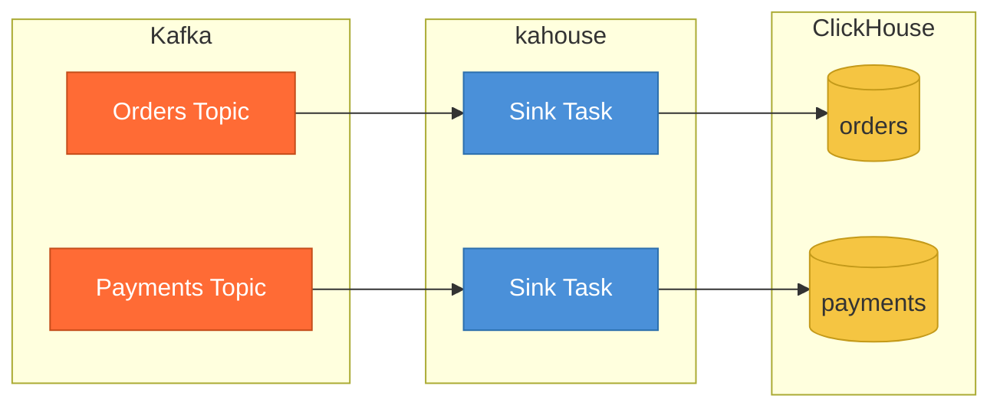

# kahouse

A lightweight Go service that sinks Kafka topics into ClickHouse tables.


```mermaid
graph LR
    subgraph Kafka
        T1[Orders Topic]:::kafka
        T2[Payments Topic]:::kafka
    end

    subgraph kahouse
        S1[Sink Task]:::pipeline
        S2[Sink Task]:::pipeline
    end

    subgraph ClickHouse
        CH1[(orders)]:::clickhouse
        CH2[(payments)]:::clickhouse
    end

    T1 --> S1 --> CH1
    T2 --> S2 --> CH2

    classDef kafka fill:#ff6b35,stroke:#c44d1a,color:#fff
    classDef pipeline fill:#4a90d9,stroke:#2c6fad,color:#fff
    classDef clickhouse fill:#f5c542,stroke:#c49a1a,color:#333
```

Each topic gets its own sink task running a single loop: read a message, decode it, append it to a batch, and flush to ClickHouse when a size or time threshold is reached. A failure in one topic stops only that task, the others keep running. Stopped topics can be restarted via the [admin API](#admin-api) without redeploying.

Delivery is **at-least-once**. Offsets are committed only after a batch is successfully written to ClickHouse. On restart, some records may be re-delivered. Deduplication is your responsibility (e.g. `ReplacingMergeTree` with an application-level key).

## Quick start

```bash
go build -o kahouse ./cmd/kahouse
./kahouse -config kahouse.yaml
```

Or with Docker:

```bash
docker build -t kahouse .
docker run -v $(pwd)/kahouse.yaml:/kahouse.yaml kahouse
```

## Configuration

Create a YAML config file and pass it with `-config <path>` or the `KAHOUSE_CONFIG` environment variable. Defaults to `kahouse.yaml` in the working directory. See [docs/configuration.md](docs/configuration.md) for a full reference of all options.

```yaml
kafka_brokers: "localhost:9092"
schema_registry: "http://localhost:8081"
clickhouse_dsn: "tcp://localhost:9000"
group_id: "kahouse"
input_format: "avro"              # avro | json | string
dlq_topic_suffix: ".dlq"

batch_size: 10000                 # max records per batch
batch_delay_ms: 200               # max ms to wait before flushing
max_retries: 5
retry_backoff_ms: 100

topic_tables:
  - topic: "orders"
    table: "default.orders"
    format: "json"                # override global format
  - topic: "payments"
    table: "default.payments"
    format: "string"
    string_value_column: "raw"
    max_retries: 0                # fail fast, stop on first write error
```

See `config.yaml.example` for a full annotated example.

## ClickHouse

Table columns must match the fields in the decoded messages.

```sql
CREATE TABLE default.orders (
    id        Int64,
    name      String,
    price     Float64
) ENGINE = MergeTree()
ORDER BY id
```

For `Nullable` Avro fields, use `Nullable(T)` column types. For sparse JSON (where records may have different keys), all columns that might be absent should be `Nullable`.

Async inserts are disabled by default (opt-in). Enable them with `clickhouse_async_insert: true` and optionally `clickhouse_wait_for_async_insert: true` in the config file.

### Kafka metadata columns (optional)

Inject Kafka message metadata as extra columns on each row. Enable per topic by adding a `kafka_metadata:` block — each subfield is optional, and column names must exist in the target table.

```yaml
topic_tables:
  - topic: "orders"
    table: "default.orders_enriched"
    format: "json"
    kafka_metadata:
      offset:    "__offset"     # int64             -> UInt64 / Int64
      partition: "__partition"  # int32             -> UInt32 / Int32
      topic:     "__topic"      # string            -> LowCardinality(String)
      timestamp: "__timestamp"  # time.Time         -> DateTime64(3)
      key:       "__key"        # string (raw bytes)-> String
      headers:   "__headers"    # map[string]string -> Map(String, String)
```

On collision with an existing record key, the metadata value wins and a warning is logged once per column. See [`docs/examples/kafka-metadata.yaml`](docs/examples/kafka-metadata.yaml) for a standalone example.

## Error handling

Write failures are retried with exponential backoff. If all retries are exhausted, the task stops. Since Kafka retains messages, restarting the task replays from the last committed offset.

Decode errors (bad JSON, schema mismatch, corrupted payload) also **stop the task** by default. This is intentional, bad data should be investigated. When the cause is known and you need to unblock consumption, use repair mode.

### Auto-restart

By default a supervisor distinguishes *why* a task stopped and acts accordingly:

- **Transient** stops — ClickHouse timeout / retriable error, transient Kafka commit failure — are **restarted in place** with exponential backoff (`auto_restart.initial_backoff_ms` doubling up to `max_backoff_ms`). Each topic has its own consumer group, so a restart does not rebalance other topics. This lets the service ride out a slow or briefly unavailable ClickHouse without manual intervention.
- **Fatal** stops — poison message in strict mode, non-retriable ClickHouse error (e.g. schema mismatch) — are **left stopped** for an operator, exactly as before. A restart cannot fix them.
- If a task keeps crash-looping past `auto_restart.max_stuck_s`, the supervisor gives up and fails `/livez` so Kubernetes recycles the whole pod as a last resort.

Set `auto_restart.enabled: false` to keep the previous passive behavior (crashed tasks stay stopped until restarted via the admin API). See [`docs/configuration.md`](docs/configuration.md) for all knobs.

### Repair mode

Enable repair mode per topic via the [admin API](#admin-api):

| Mode | Behavior |
|------|----------|
| `dlq` | Send bad messages to the DLQ, continue consuming good ones |
| `skip` | Discard bad messages, continue consuming |

Repair mode resets to off when a topic is restarted, preventing forgotten repair modes from hiding future bad data.

### Dead letter queue

When repair mode is set to `dlq`, bad messages are forwarded to `<topic><dlq_topic_suffix>` (default: `<topic>.dlq`).

Each DLQ record is a JSON object:

```json
{
  "original_topic": "orders",
  "error": "failed to decode message: ...",
  "timestamp": 1712345678000,
  "key_base64": "b3JkZXItMTIz",
  "value_base64": "eyJpZCI6IDEyM30=",
  "payload_encoding": "base64"
}
```

Key and value are base64-encoded to preserve binary payloads (e.g. Avro).

## Observability

Default port is `9090` (configurable via `metrics_port`).

### Health endpoints

| Endpoint | Description |
|----------|-------------|
| `GET /livez` | Returns 200 unless (a) the supervisor flagged a task for recycle after exhausting auto-restart, or (b) every task has stopped AND at least one stopped unexpectedly. Operator-initiated stops (admin API stop/restart, SIGTERM) keep `/livez` at 200, so kubelet does not kill the pod during maintenance or graceful shutdown. A single transient crash does not fail `/livez` — the supervisor restarts it in place. |
| `GET /readyz` | Returns 200 if ClickHouse is reachable and all consumers have partition assignments (so a task stopped or crash-looping makes the pod NotReady) |
| `GET /metrics` | Prometheus metrics |

### Admin API

Operational endpoints for managing individual topics at runtime.

| Endpoint | Description |
|----------|-------------|
| `GET /api/topics` | List all topics with status, stop reason, and repair mode |
| `POST /api/topics/{topic}/stop` | Stop a single topic |
| `POST /api/topics/{topic}/start` | Start a stopped topic (409 if already running) |
| `POST /api/topics/{topic}/restart` | Stop and start a topic |
| `POST /api/topics/{topic}/repair` | Enable repair mode: `{"mode":"dlq"}` or `{"mode":"skip"}` |
| `DELETE /api/topics/{topic}/repair` | Disable repair mode |

```bash
# Check which topics are running
curl http://localhost:9090/api/topics
# -> [{"topic":"orders","table":"default.orders","status":"stopped","stop_reason":"crash","stop_class":"transient","repair_mode":""}, ...]
# stop_reason is "operator" (admin API stop/restart or SIGTERM), "crash" (unexpected exit),
#   "table_missing" (configured but never started because its target table did not validate), or "" (running).
# stop_class refines a crash: "transient" (auto-restart eligible) or "fatal" (needs an operator); "" otherwise.

# Start a stopped topic
curl -X POST http://localhost:9090/api/topics/orders/start

# Enable DLQ repair mode
curl -X POST http://localhost:9090/api/topics/orders/repair -d '{"mode":"dlq"}'

# Disable repair mode
curl -X DELETE http://localhost:9090/api/topics/orders/repair
```

### Prometheus metrics

All metrics are labeled by `topic`.

| Metric | Type | Description |
|--------|------|-------------|
| `kahouse_msg_consumed_total` | Counter | Messages read from Kafka |
| `kahouse_msg_produced_total` | Counter | Messages written to ClickHouse |
| `kahouse_msg_failed_total` | Counter | Deserialization errors + write failures |
| `kahouse_msg_dlq_total` | Counter | Messages forwarded to DLQ |
| `kahouse_task_stopped` | Gauge | 1 = stopped, 0 = running |
| `kahouse_task_restarts_total` | Counter | Admin API restarts |
| `kahouse_task_auto_restarts_total` | Counter | Supervisor auto-restarts of transiently-crashed tasks |
| `kahouse_task_recycle_escalations_total` | Counter | Times the supervisor gave up and escalated to a pod recycle via `/livez` |
| `kahouse_batch_size` | Histogram | Records per flushed batch |
| `kahouse_batch_delay_seconds` | Histogram | Age of oldest record in batch at flush time |
| `kahouse_process_latency_seconds` | Histogram | ClickHouse write duration (includes retries) |
| `kahouse_write_retry_count` | Histogram | Retry attempts per batch write |

## Testing

```bash
# Unit tests
go test ./...

# Integration tests (starts all deps via Docker Compose)
./scripts/test-integration.sh
```

## License

[MIT](LICENSE)
